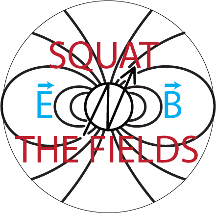
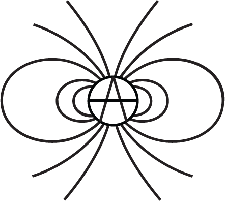
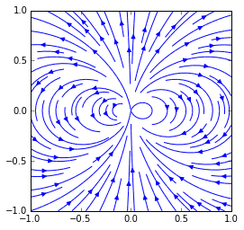
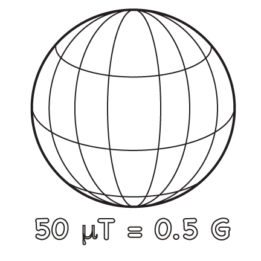
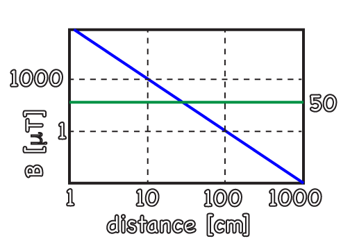
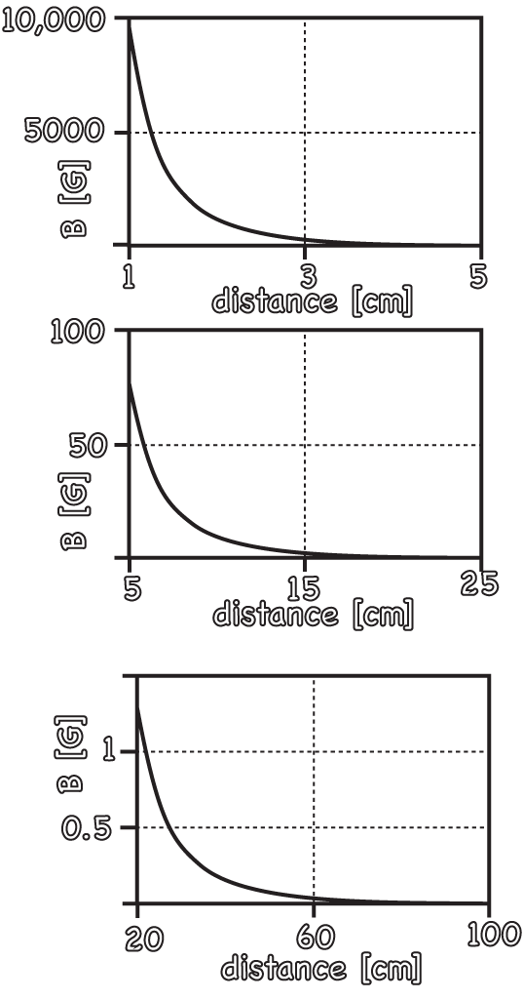
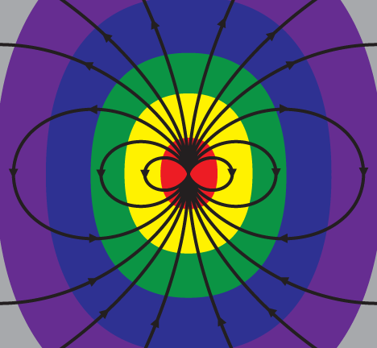

The fields I will talk about here are truly like the Force in Star Wars.  

1. Fields, give examples, draw piectures, mass-density revisited
2. the electric field: go through physics texts and make sure we cover it all, build van der graaf generator using rotational motor, create plans to build it
3. electric field theory: lots of images with fields shown, units used, examples with lightning and capacitors
4. electric field experiments: use the van der graaf and the trash wizard stick to measure E, q, C, F etc.  Fields in matter with Leiden Jar demo
5. electrostatic motors with van der graaf, lots of pictures with fields and forces shown, currents computed
6. magnetic fields, images and concepts, relation to force and currents, many pretty pictures
7. go through the relativity thing in the physics texts, tie that in here conceptually
8. experimental magnetic field mapping with trash wizard stick/phone.  magnetic fields and loops of wires also explored with TWS
9. images of fluid flow maps
10. measure fluid flow with phone somehow
11. fluid flow at low length scales
12. temperature fields, images with phone, measurement with phone, thermal conductance measuremnt with phone, ipython notebooks for all the different types of field
13. lots of physics tie ins with the phone
14. build physical field calculators for dipole, study the dropoff in ways that make sense without a ton of math
15. draw out cartoons showing how E and B fields relate to each other

$$ \theta \nabla^2 $$

 

 

 

more figures:

1. cross product cartoons showing how current and field and force work
2. field from a loop of wire
3. field from a single wire
4. field from a van der graaf generator
5. field from a realistic disc of magnet
6. field of velocity of water flow through a pipe
7. field of non laminar and laminar flow, at different scales
8. graphs of dropoff of field from dipole
9. graphs of fields in various waves
10. gravitational field cartoons
11. stress and strain field cartoons
12. Maxwell's equations cartoons showing how fields relate
13. dipole radiation cartoon

each of these also gets a ipython notebook with the full calculation and units

# Force and mass

Density field most tangible, the only field here with mass

# Electric Field, Voltage

E field from a charged ball, B field from a dipole, the concept of dipole, the mystery of the monopole 

must have visualization with phones here, van der graaf and other high voltage experiments, I should build a van der graaf, have design in appendix with motor in motor chapter, but have photos here with info on value circle method to get a vdg from someone else in the Network

# Electric Current and Charge

More applications of electric field, 

# Magnetic field 

vector potential may be useful for our graphical approac, go back through the whole vector potential thing for magnetic dipoles

use of smarth phone to see the fields, use of pickup coil to see changing flux

 

 

 

 

 

 

 

 

# Pressure and velocity of fluids

# Temperature

do experiments, show platinum thermometer usage, smart phone usage

# vector calculus

real examples with measurements of the vector calculus operators, gradient, divergence, curl, laplacian.  vector and scalar potential, gauge transformations.  