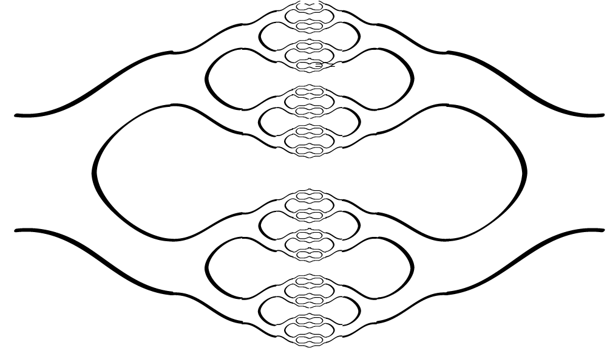
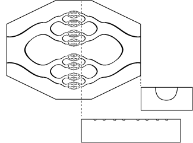

Near term projects to DO:

1. test SlimeZistor some more, observe and record data again, try different time scales
2. test same with gate attempt on different materials of slime
3. build pump enclosure
4. once pump works, build a fractal pump system where one pump drives large volume through many small area channels, with electrical access
5. do experiments trying to use heat and pressure to make channels in thermo plastics of various shapes and sizes, try different tools and molds and temperatures and methods
6. Try simple biological detector experiments, buying enzymes and testing saliva and stuff electrically. If this works, work on design of fractal trash bio metrology tool with high throughput
7. if the electrical transport of tiny channels is working nicely, try different layers of n and p type liquids, try making a pn junction and testing it in the normal slimeZistor way with pulse and response.  If that works, try NPN, see if it's a transistor
8. build a simple electrolysis reactor to make H2 and O2
9. build O2 plasma machine, play with patterns, make tiny plasma tubes with high voltage generators

 
 

 
 

# boba straws can be the standard input!!!!!!

Fractal Reactors starts the whole thing, moving fluids around, actually make pumps at different sizes, make a fractal setup

finding your thermo plastics, working them, being safe

The Fractal concept, some history, Mandelbrot etc.

make fractal plumbing using simple hot rework tools for thermo plastics

This chapter almost certainly needs to get merged with Fractal Reactors and Living Matter, which will be lengthy.  Possibly the two topics should be two chapters, but with one being much more focused on building the demos and the other on how to scale the system up and apply it in the future.

# Computers and Authoritarianism

# A different model for computers

# Measuring the Slime of the World

# Building up SlimeZistor TEchnology

# Building the Computer you Actually Need

# CPU Clocks are a Monotheist Conspiracy

Laminar Fluidic nanocomputer.  Layers of fluids join in tiny channels at the nano scale using the fractal reactor, ions in solution create doping, electrolytes conduct electriity to copper on grids, wires move around as needed in fluids as well, 

# Fractal Reactors and Living Matter

Everything is made of thermo plastics.  Everything has pumps and valves driven by the usual Philosophy Engines.  Fuilds that can be pumped through any of the various tubes, allowing close to neutarlly bouyant robots to flow through to any location, and edit the tubes using heated tools.  So the whole thing can self-edit by moving robotic workers around with pumps.  

Biological systems can easily be integrated into the whole thing, grown, moved around, analyzed, combined, and used.  

Everything can be pumped with fluids, vacuum, air, other gasses, hot or cold fluids, biological slime, and various plasmas.  

HIgh voltages can drive electrostatic actuators anywhere and high currents can drive coils to drive magnets anywhere.  

Basic test systems can be made by cutting with heated tools into soft thermo plastics like vinyl to create channels, then pressing Saran wrap(half mil film of PVC or LDPE) or silicone or PMMA across the top with adhesive to make a flexible or rigid top. 

# The Shit Reactor

THis is how the shit is processed.  A turd drops into a large end of a fractal structure.  it's partially immersed in water which has slow flow, and the air over the top has a constant flow rate also out to the branches from the trunks.  Robots of varying sizes cut up the turd parts and distribute them down tubes, then cut them up more with smaller robots and drag them down more tubes, all with fluid and air flow.  Another set of tubes moves heat along to control temperature in reactor chambers, on the smallest scale, with largest posible surface area to connect to dirt based bio reactor.  