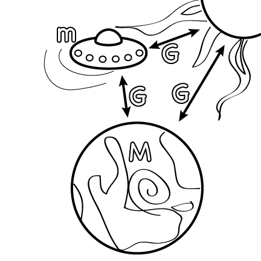
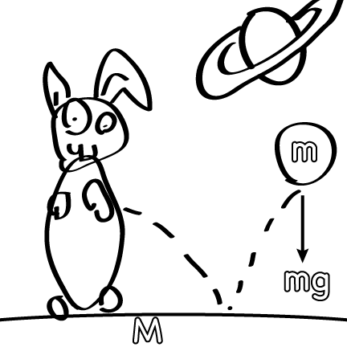
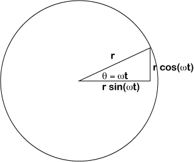

### introduction

In order to wield the magic of Trash, we must be able to measure the world around us, and all the beautiful trash we find there.  This is the Trash Magic version of what is normally called "metrology", the science of measurement.  Just as capitalist metrology is often built on the needs of business for measurement and the ability of private business to be able to  build the tools needed, our metrology will be based on our ability to use Trash Magic to do it, and to do the things that Trash Wizards and Trash Witches will need in order to wield their magic.  This means that while our units will be based on theirs initially, we might end up with our own global infrastructure for construction and preservation of units, which could well lead to new definitions.  

The metrological structures we deal with in today's capitalist world are a direct product of the French Revolution.  At that time, the Metric System, also knows as the Systeme Internationale, or SI, was part of a  revolution in culture where a set of universal ideals were to guide measurement, freeing the people from the decrees of kings and other absolute rulers.  While this revolutionary spirit was a powerful positive force in some ways in its day, I believe that the spirit of the French Revolution helped create an overly mechanistic culture that has become far too divorced from the physical reality of the human body.  One reason I like Fahrenheit for instance is that 100 degrees is what feels very hot to a human being and 0 is very cold.  If you get below 0 or above 100 you're pretty far outside the normal range that people want to be in.  I find that to be very reasonable for weather, especially since weather is so poorly predicted or measured that using a more official standard temperature might not make sense.  

So Trash Magic Metrology is partly a revolt against the dehumanizing ideals of the French Revolution.  We revel in the fact that the basic time unit, the second, is comparable to a normal human heart beat.  We like that a meter is about half as tall as a tall person.  The French pushed very hard the other way, in the peak of revolutionary fervor trying to go to a decimal day, trying to force humans into what I view as a more machine-driven mode of existence.  It is interesting that so many of the loudest and most articulate critics of our modern mechanized capitalist order have always been French.  Could it be that this is because of the dynamics of that revolution they've been faced with a monstrous machine the longest?  

I don't mean to denigrate the great work done by those who have built up the SI over the lest few centuries.  It's amazing!  I believe that there is a place for duplicating the atomic clock, the Watt balance, and various other amazing feats of measurement science in the post apocalyptic waste land that future Trash Magicians will live in.  However, as we re-build all that from Trash, there will inevitably be a lot of changes that are made in approach.  

Today we live in a world where just about everyone on Earth is connected to a cellular data network that is synchronized off of atomic time such that we all are connected on the same exact time to a few parts per billion of accuracy.  But how horrible is that?!  What monstrous inhumanity we force on our fellow people by forcing workers to stop work to eat at exactly the same time across many days' journey from each other!  And yet, while time is regimented to 8 digits across our whole species, our medical tests remain some of those with the worst metrology.  When life and death literally hang in the balance, as your blood is measured in various ways that need to be responded to quickly by medical personnel, we get crappy for profit companies charging too much money for slow, inaccurate tests.  Could large numbers of infinite-zero cost fluidics systems not just make medical tests fast and free, but make them better?  I believe so.  And should we build that before we figure out how to build a cesium atomic clock out of trash?  Probably, yes.  

### distance, and time

The first thing to talk about is distance.  I believe that it makes sense to use several units for this, both SI(metric) and English.  The base SI unit is the meter, which is a little over 3 feet.  The official SI definition is based on the speed of light and the definition of a second.  So a meter is how far light goes in one light second.  Which is a circular definition, but not a useless one.  Light goes at about 1 foot per nanosecond(a billionth of a second), so 1 meter is how far it goes in about 3 nanoseconds.  

This immediately can be considered in the context of Trash Wizard technology.  We will use various smart phone related technologies in our stuff which have computers with clocks that run at 1 GHz or above.  At that speed, each clock cycle only takes a nanosecond or less.  So if your phone puts out a signal that bounces across the room to some robot and back, say about 30 feet, a whole 30 clock cycles can run on your computer while the signal is out bouncing around!  Note also that this speed will be slower if your "light" is in some material, such as radio signals going down a coaxial cable with teflon in it.  The factor is usually about 40% lower than the normal speed, so rather than going a foot in a nanosecond your signal in coax might go about 8 inches.  

One way to relate distance to time and light is to make radio resonances that you can measure.  This can be done by melting marshmallows or chocolate with some sort of high power microwave radiation gun with a resonant cavity.  However that is both cumbersome, potentially dangerous, and not very accurate.  For most every day measurements you want a ruler for your Trash Magic Stick, possibly a simple set of calipers and/or micrometer, and various parts of your own body.  The body based measurements I find the most useful are the "wingspan" measurement, where you measure a rope, cable, or chain by pulling it out across your full span from outstretched hand to outstretched hand, and repeating and counting, and multiplying by that distance.  For a lot of people that's around 6 feet, also known as a fathom, also known as two yards.  Then there are paces, which are typically about a yard, or 3 feet or half a fathom.  Many charts in the United States use fathoms for depths.  The ability to measure out a number of fathoms quickly in a small space with a rope, chain or wire is useful for doing quick depth measurements.  

For parts where inches and mm are relevant, I favor using all the metric units from micron to mm to cm to m to km, as well as the "mil" or thousandth of an inch, the inch, foot, yard, fathom, and mile.  A VERY IMPORTANT conversion to know is that just as 2.54 cm is an inch, 25.4 microns is a mil, or thousandth of an inch.  One micron is a slang term for micrometer, which is one millionth of a meter.  A hair or fur is generally between 50 and 250 microns thick.  There are 1000 microns to the mm.  

Note also that the original legal definition of the meter that came out of the French Revolution was "1 ten millionth of the distance from the equator to the North Pole".  Or something to that effect.  So the Earth was the universal measuring stick, and to calibrate that, epic adventures were had to go do trigonometry over many degrees of latitude change, mostly in the middle of a war zone.   Awesome.  

What about time? A teacher I had in school used to say that the kings and queens of units were time, frequency, and distance.  Time is almost absurdly well measured at every possible level.  The accuracy of the atomic clock is beyond any other measurement we can make, and the global telecommunications network distributes that accuracy better than any other unit.  It's amazing!  And basically free, as long as the existing infrastructure continues to exist.  As I said above, we'll have to eventually duplicate that system as the existing system inevitably crumbles but that day is far enough off to not cover the technology here!  For the sake of this work, I consider time to be something we can measure to arbitrarily high accuracy using cell phones and arbitrarily high precision and speed using fast computers and data acquisition.  

### Speed

And finally, with distance and time I must consider speed.  You already know speed is how many units of distance a thing moves in a given unit of time.  But I want to mention what units we'll be using and why, and some key speeds.  

The SI unit of speed is of course the m/s as the meter and second are the SI units of distance and time.  The most popular speed units for most people, however, are the mile per hour and the kilometer per hour, depending on where you live.  So I think it is important to compare various speeds in these three systems.  Also I think it's useful to do this for various specific speeds we should be familiar with:

phenomenon					   | mph		 | kph | m/s
------------------------------|-------------|-----|----
brisk walking pace			   | 4          | 6.4 |1.8
fast run					   | 10			| 16  | 4.5
car on a high speed freeway   | 60         | 97  | 27
commercial jet				   | 570 		| 917 | 254
speed of sound in air		   | 770     | 1240 | 340  
speed of sound in steel		   | 13,200 | 21,200 |5900
speed of light				   | 7E8 | 1E9 | 3E8

The rule of thumb for going from mph to m/s is that the m/s number is about half.  So for example, how man m/s is a 50 mph wind?  about 25 m/s.  

One more speed unit that must be addressed is the "knot".  This is a unit that comes up in nautical, aeronautical, and meteorological applications.  The knot is confusingly short for nautical mile per hour, even though the spelling is different.  So while it appears to be short for "nautical", it is in fact a unit that comes from the way speed used to be measured at sea: observing flow relative to a rope with a bunch of knots tied in it.  So the term knot is in reference to how it used to be measured.  Another annoying thing about this unit is that the nautical mile is about 1.14 "statutory miles", what you know as a mile if you're from a country that uses them.  So it's very close but not quite the same as just using mph.  So for *very* rough calculations to get from knots to mph just add 10%, or just ignore the difference if your uncertainties are already huge compared to 10%, which they often will be for Trash Magic methods.  

The last thing to say about speed, is that it's not the same as velocity.  They are measured in the same units, but technically velocity is speed *and* direction.  So while wind speed might be 5 mph, the wind *velocity* would have to be 5 mph southerly or northerly etc wind.  Speeds are always positive, but velocities can be positive or negative along any of several axes. I'll be talking more about vectors(things with both magnitude and direction) in the fields chapter.  

### mass, volume and density

The next quantity I want to talk about is mass.  Mass is the property an object has that gives it momentum and responds to gravitational force.  When a force is applied to an object, mass is what determines how fast it accelerates(how much the speed speeds up, the speed of the speed).  The way I most want to deal with mass in Trash Magic is by converting from volume using densities.  Density is the amount of mass an object has per unit of volume.  Volume has units of distance cubed, or distance times distance time distance.  

The most commonly useful volume units to the trash witch are the milliliter and liter.  The thing that's so great about these is that they're a cubic centimeter and cubic deciliter, respectively.  So that makes it easy to convert between volume and distance units.  You can easily imagine a bunch of cubes, 1 cm on a side, being stacked up to make some object, and the number of those blocks is the volume in ml.  If a thing fits in about a 10 cm on a side cube, it's about a liter.  

Now for densities, there are roughly 4 I will reference the most.  At the lightest end is air, which has about 1 kg mass of air per cubic meter.  A cubic meter is 1000 liters.  Next up is water, which has a density of about 1000 times that of air.  So about 1 gram per ml, as opposed to 1 mg per ml for air.  A lot of things are the same as water! Most parts of most organisms' bodies, both animal and plant, including us, are similar in density to water.  So for estimating physics with your own body, assuming it's about 1 g/ml is pretty good for getting started.  Most of the plastics and rubber materials we will use for Trash Magic also have a density of about a gram per cubic centimeter.  Hence some plastic floating and some sinking--it's pretty close to water.  Wood, which generally floats, tends to be in the range of half the density of water.  Some hardwoods are exceptions that get to close to water, and can sink.  

Next up in density from water, plastic, rubber and wood is things in the range of rock, glass, aluminum and silicon.  These materials are generally in the range of 2-3 g/ml, so about 2-3 times the first list of solids and liquids.  We will be working a lot with stones and found aluminum parts, as well as glass, and various semiconductor devices.  All these things will be in this range of density.  

The last set of densities that will come up repeatedly in this work are things in the range of steel.  Steel is about 8 g/ml, so about 8 times denser than water.  Rare earth magnets, which play a central role in all Trash Magic, have a similar density to steel, as well as everyones second favorite superconductor, niobium.  Also, copper, which is central to this work, has a density similar to steel.  There are other heavy metals like lead and gold which are much heavier but we will not be using them much.  The list of basic materials that are in the range of 0.001, 1, 3, and 8 g/ml is so much more central to this work than anything else that I call them out here, and intend to come back to them in future calculations frequently.  

### Force and Acceleration

First of all, I'm going to say what acceleration is.  Acceleration is the change of velocity with time, just as velocity is the change of distance with time.  So while velocity is measured in m/s, acceleration is measured in m/s per second, which is $$$m/s^2$$$.  While there are perverse American physics texts that use feet per second per second, there is no very good excuse for this, and I use $$$m/s^2$$$ exclusively here, which is the SI unit of acceleration.  This unit does not have a special name.  However when you multiply it by a kilogram to get $$$kg m/s^2$$$, that *does* have a special name, and it's the newton(unit names are always lowercase even if they're a person's name).  The symbol for a newton is N.  The unit many American's are most used to is the pound.  This gets into a very confusing aspect of these measurements.  In common language, kilograms and pounds are both used to measure how much something "weighs", meaning how much gravitational force is exerted on it by the Earth at the surface of the planet.  But they measure different things! The SI unit of force is the newton, while the unit of mass that goes along with the pound is called the "slug" and in my experience is only used for jokes and laughs.  

So for symmetry, I'll compare the two directly and say that 1 newton is equal to $$$1 kgm/s^2$$$ and one pound force is 1 slug times 1 ft/s^2.  What a mess!  I'll get to the equations and physics behind this in a minute, but first I want to compare weights of masses on Earth to get all these units compared to each other:

quantity | pounds | kg | N  | slugs
---------|------- |----|----|------
1 pound  |   1    |0.45|4.45| 0.031
1 kg     |  2.2   |  1 |9.8 | 0.069
1 N      |  0.22  |0.10| 1  | 0.007
1 slugs  |  32.2  |14.6|143 | 1

I'm going to jump right in with an equation here, it's called Newton's Second Law, here it is:

$$$
\vec{F} = m\vec{a}.
$$$

This just says that when you push on a mass m with a force F you get an acceleration a.  Specifically in the case of an object on the surface of the Earth, with no forces other than gravity, the acceleration is always what's called "little g".  Little g is a combination of "big G" and the mass of the Earth.  Big G relates all the massive objects in the Universe.  As I will discuss in the fields chapter, this is one of the magical force fields that flow through All Things That Exist.  Little g is about 9.8 m/s, which we will round to 10 in almost all cases in this work.  

 
 

I will use the above table as an excuse to jump into an important tool for trash magic: google calculator.  In google calculator you can change any unit into any other unit by putting in something like this: "10 pounds in kilos" or "convert 10 lbs to kg".  In either case google will convert for you and show the final units.  So for instance you can also say something like "1 slug * 1 foot/1 second^2" and it will give you 4.45 N, which is what's in the table above(rounding appropriately).  Very useful!  It has lots of obscure units like the cubit, fathoms, etc.  Another example would be "1 slug\*1 mile\*1 rod/(1 fortnight* 1 week)", and google will automatically convert to the SI unit this represents, and since it's energy that will be joules.  Amazing!!  I hate to advocate using an evil corporation's tool like Google but it is really free using our tech so let's use it.  There is also a method for using units in Python with various packages, which I'll cover in the iPython notebooks associated with this chapter.  

Gravity as force and acceleration, units, ipython gravity notebook

measure acceleration on a smart phone

use integrals to get from acceleration to speed and from speed to position

ipython notebook to make the phone do all the things listed above and graph them

get a phone to act as fit bit or whatever to track sports bullshit and graph it all using your mass

the smart phone must be able to quickly get data into a iphython notebook for plotting and analysis, there should be a full set of experiments for mass and acceleration by swinging and throwing phones around.  The calculus lives here. 

for each of these, talk about units used, orders of magnitude, conversions, meaning, and how to measure, typical values of things.  Also post apocalyptic metrology, metrology from cars, piggyback metrology on existing nation states and corporations. Each unit gets a ipython notebook.  Each unit has a simple measurement.

new version of order:
1. distance
2. speed
3. area
4. volume
5. density
6. mass
7. force
8. 

1. mass
2. position, with or without direction
3. velocity and speed
4. acceleration
5. rotation
6. force
7. mass flow
8. charge
9. charge flow(current)
10. voltage
11. energy
12. impedance
13. volume, density
14. inductance
15. capacitance
16. resistance
17. spring constant

It looks on examinign this that I need a resonator chapter, right after motors, when the motor has been built and testing is happening.  Need to get ideas of Q and damping in, real and imaginary Z.  

### Start with Mass

What is mass?  How do we measure it? Why do we care?  Mass represents how much of something there is in an object.  Everything I deal with in this work will either be some sort of massless field like the field around a magnet, or various objects and substances made up of atoms.  In the case of the former it mostly does not make sense to talk about mass.  In the case of the latter the total mass can generally be thought of as the number of atoms times how heavy each atom is.  We can think of an atom as a sun-like nucleus surrounded by a cloud of probability that describes the location of electrons on the outside.  The nucleus is made up of positively charged protons and neutral neutrons

If we ignore the electrons it always make a much smaller than 0.1% difference and they can be ignored.  

watt balance and also the silicon ball demonstrate a electric balance of some kind

Water and density, and getting mass from water volume, on other densities. Do experiments with drink bottles of water, post apocalyptic balance, lever theory and use

The American illegal drug trade, American cook books, and mixed units

masses of:
1. earth
2. moon
3. human
4. a blood cell
5. an atom
6. a hemoglobin molecule
7. an electron compared to an atom, mass energy equivalents again

add mass flow here, talk about mass flow controllers, how mass flow is like electricity, set some markers here to return on on electricity

momentum, momentum of water in a pipe, toilet circuit, compute R, L, C of the flush and refill. 

little g and big g

figures: 

1. scales
2. watt balance
3. silicon sphere image
4. kilogram in france
5. spring scale

atoms and mols

### rotational motion

start with angles, introduce radians, give examples in ipython of radian units, have a table

simple trig cartoon 

 

F u ma again, but in rotation: torque, angular momentum

Again, must have entire suite of smart phone experiments to test this.

sin, cos, period, frequency, angular frequency, generic nature of resonance, forshadowing of things to come in resonance, mini rant about importance of themes like resonance threading throughout your physics education curriculum.  

### Electrical Units:

charge first, then voltage, then measure EVERYTHING with the arduino, go step by step through the RC demos on the arduino with resistors, not slime.  Loop this back to the pipes, toilets, etc.  

RC experiment leads into the LR experiment, and inductance, and again back to the pipes and toilets, connect impedance between toilets and these circuits as well

Some trivial electrical and water based resonators

more about charge, real units, ipython notebook for that, also ipython notebooks for:
1. all the electrical units
2. control and graphing RC
3. control and graphing LR
4. control and graphing LRC
5. specific component value units, examples
6. build an LRC meter with the trash wizard stick--this should have a gui that lives in the browser of a smart phone, talking to the pi zero, which talks to the coil drive board, which measures voltages

 need to build a van der graaf generator using the Motor and a mechanical electrometer to do E field measurements of space around the 

also an electrostatic motor with pop bottles!  All pop bottle technology!  

figures:

1. images of components
2. schematics of experiments
3. graphs from experiments with explanations of units
4. photos of experiments

### magnetic units

Magnetic units are explored using wires, magnets, various household items, and smart phones to measure the field.  Go out and measure power lines, compute current, measure AC magnetic fields.  

### springs

wood, steel, hooke's law, mechanical impedance, examples, measuring k, units, ipytyhon notebook with unit examples, damping constant

1. cartoons of springs
2. photos of springs

again with the smart phone

### impedance units

my whole impedance discussion goes here ,connecting electrical and mechanical, leading into more detail later with the waves

### energy and power units

### Dimensional analysis and Factor Label Method gets whole section

Google calculator with units
Ipython with units
BIPM, the NMI system, and metrology
constants vs. units and the quantum SI
