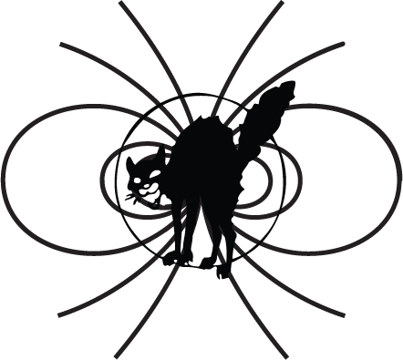

#   Theory and Practice of Trash Magic

### Lafe Spietz 2016

 

[Intellectual Property Notice("license")](intellectual_property_notice.md)

[Bibliography](bibliography.md)

[Funding Proposal](heilmeier_catechism_lafelabs.md)

[Demo List](demo_list.md)

[Glossary List](glossary_terms.md)

[Format Notes](format_notes.md)

[Technical Roadmap](technical_roadmap.md)

[Purpose of Book 1](purpose_book1.md)

[Illustrations for Book I](illustrations_for_book_i.md)

[3d files for volume 1 ](3dfilesVolume1List.md)

[videos for volume 1 ](videos.md)

### Book 1. Philosophy of Trash Magic: Ways of Witchery and Wizardry

1. [What is capitalism?](capitalism.md)
2. [What is free technology?](free_technology.md) 
3. [Statement of Principles](Principles.md)
4. [What is Trash Magic?](what_is_the_trash_wizard.md)
5. [taking over the universities](universities.md)
6. [Rumbles of Robots](RumblesRobots.md)
7. [Free Drugs, SlimeZistors, and Ion Magic](slimeTechPolitical.md)
8. [Magic Tales and Magic Lore](value_circles_economics.md)
9. [The Great Junk Car Feed](JunkCars.md)
10. [Factories Everywhere and Nowhere](means_of_production.md) 
11. [Visions of a Better Tomorrow](visions.md)
12. [Free Everything](problems.md)
13. [Techniques](techniquesBook1.md)
14. [Let's Build This!](lets_build.md)
 

### Book 2. The Practice of Trash Magic: the Stickening

[book 2 summary](book2summary.md)

1. [Post Capitalist Industry: Trash Magic](capitalism_technical.md)
2. [Measuring the post capitalist world](Measures.md)
3. [Fear and loathing in the vector fields](Fields.md)
4. [Coils for Magnets and Motors](coils_for_magnets_and_motors.md)
5. [Motors and Pumps](MotorsPumps.md)
6. [3d Circuit Fabrication Technology from Trash](circuit_fabrication_technology.md)
7. [Rumbles of Robots](RumblesRobots.md)
8. [Energy](Energy.md) 
9. [Resonance](Resonance.md)
10. [Skeletron](skeletron.md)
11.  [Fractal Reactors and the SlimeZistor](FractalReactorSlimeZistor.md)
12. [Supply chain data structures, call to action](data_structures.md)

## Other media, volume I only

1. 3d files for each chapter, with a VR fly thru, and 3d printer files and photos with paint, also made without 3d printers(mine are hand made)
2. videos for each chapter
3. all illustrations are coloring book images
4. artifacts distributed with the book
5. documentation for tale and lore for artifacts: noise stick, vibration stick, whirligig USB charger
6. hard cover made from soft cover by hand using trash, with magic integrated into cover, fiction chapter and university chapter will have user submitted versions in different copies, there will be local variations in these. 

