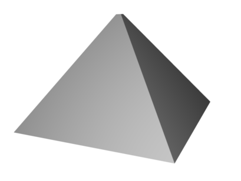
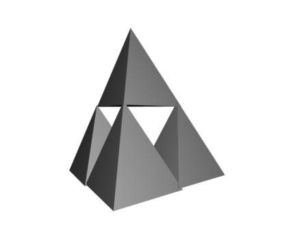
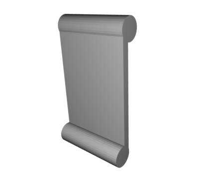

# The Fourteen Contemplations of Manifesto

## First Contemplation: Pyramid of Capitalism

In this phase we contemplate the evils of capitalism through the lens of the pyramid, a universal symbol of that ideology.  The pyramid in this phase is not built in this phase, it is handed down from some earlier fabrication possibly by someone else who gave us the pyramid.  The harder to make that is, the more it symbolizes the capitalist separation between user and maker.  This is bad, and we will contemplate it.

The pyramid can be taken out and around and put in line with various artifacts of the capitalist world for simultaneous contemplation.  In order to fully grasp this, it may be necessary to flop around on the ground to mover your head to just the right spot to *really* see the pyramid and also the capitalist artifact.  Artifacts will tend to be vast capitalist mounds of stone they use to symbolize their own power: skyscrapers, banks, huge stone pillars in parks, etc.  Also mines.  As you flop around on the ground getting different lines of sight you will eventually find the right perspective for this Contemplation, and then can make an art project out of this, in any medium: paint, ink, charcoal, pencil, pastel, plaster sculpture, stone sculpture, wood sculpture, video, photo, dance performance.  

The Contemplation can also be carried out at home by placing the pyramid in front of a small capitalist artifact, playing the proper music, and vigorously flopping around on the floor in ALL DIRECTIONS while maintaining eye contact with the pyramid and evil artifact of capital.  

Theme music for this Contemplation starts with City of Darkness by Funker Vogt, which I think captures some of the essence of capitalist evil.  Perhaps also Capitalists Suck by DRI should be part of the play list if it's more songs, and I'll add some more as time goes on.  Hopefully eventually people will compose their own free music for each Contemplation so that the culture exists outside copyright.

## Second Contemplation: Tetrahedral Fractal

Here fabrication is part of the practice, we carve out a very simple tetrahedral depression in a stick, chop up bottle caps and apply heat to them to smash them into the mold, making a plastic tetrahedron.  This process is repeated several times, and then the individual units are built up into a larger structure by welding the corners.  This contemplation involves staring at the very limited porto-fractal shape and contemplating how it would scale up and down, and the limits of that process.  How big could you make this?  Or how small?  What is easy or hard? Try it.

This is a very inward-looking contemplation, and it should involve some fairly meditative(more than the previous one) floor flopping movements.

This is about anarchy-freedom.  So anarchist songs are what this Contemplation is themed to.  I will start with the Yiddish song [Down with The Police](https://www.youtube.com/watch?v=1ft9iuZu0AI).  

[Under the Black Flag We March](https://www.youtube.com/watch?v=p1SlcO0Fikc)

[Anarchy in the UK](https://www.youtube.com/watch?v=qbmWs6Jf5dc)

[Anarchy in the USA](https://www.youtube.com/watch?v=Vg7SIU8Kpeg)

[Killing in the Name Of](https://www.youtube.com/watch?v=tA7d0OYg0rI)

## Third Contemplation: Scroll

This is a chance to do some interesting and creative wood work.  The principles should be re-read and contemplated while actively building the scroll. There are MANY ways to build the scroll, and part of the concept of this Contemplation is to use the principles of Trash Magic to keep making new ones, eventually building really new things, hopefully the plastic printing press system that can be used to make hardcopy books out of trash in bulk eventually.  The initial theme music for this contemplation is Final Countdown.  If one is running through the Contemplations quickly this will be A very fast project, where we review the principles and stare at an existing scroll.  If a new scroll is being fabricated a new sound track will have to be created.  The physical activity of this step will involve just staring at the scroll, making a new scroll, and possibly a dramatic reading of the Principles.  

[Final Countdown](https://www.youtube.com/watch?v=9jK-NcRmVcw)

## Fourth Contemplation: Elements

Earth, air, fire, water, and the Sphere if the Ion Magic.
 
Stare at them, contemplate, and interact with each of the five elements.

Run around and find the elements, stare at the fire.

All this is to the Conan the Barbarian Soundtrack

[Conan the Barbarian Sound Track](https://www.youtube.com/watch?v=ZeZL2R9jDJM)

