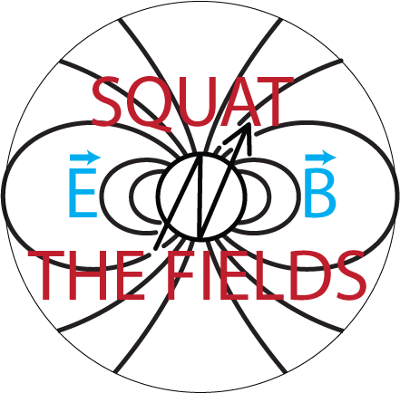
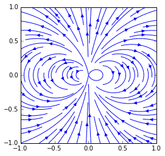

# Figures Only for Fields Chapter

note: need to add a drawing from a photo of a hand for right and left hand rules

experiment: need to use the trash wizard controller to make magnetic hysteresis plots for various materials around the junk yard.  

 
 
 
 
 
 
 
 
 
 
 
 

