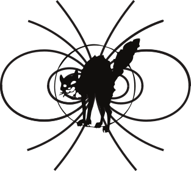

# Chapter 4: What is Trash Magic?

## Why Trash?

Who owns a dog turd left on the street?  Who owns the piles of plastic bottles that collect in an eddy of an urban stream?  Who owns the soot that collects on the walls of a bus stop?  No one.  The concept of private property, which I regard as evil, does not incorporate all things. For capitalism to function it has to have both "assets" and "liabilities", which the capitalists associate with opposite signs of numbers.  What if a turd is not a liability or an asset?  It does not exist in the capitalist universe, it is their ultimate trash, of value to no one, and it is the seed that we must use to create a better world.  

## Why Magic?

Many reasons.  First of all, what exactly is magic?  It's subjective.  Magic is what, subjectively, gives us a certain feeling of wonder about the world.  I believe that that wonder should be intrinsic to our technology always, just as we expect it to be with art.  Hence the removal of the artificial separation between art and technology is a path to what is essentially a form of magic.  

Also, the use of this word is very annoying to members of the technocratic priesthood which this work seeks to undermine. The very possibility that someone might do something useful and interesting in a sphere called magical is upsetting to them, because it is clearly not part of their "pure", "rational" world.  This thus draws a line in the sand of sorts: on one side is engineering and business and the rest of the "rational world", and our work stands very much on the other side, where things are a little less sharp and clear and countable.  Hence my statements in the first chapter about Trash Magic being an artistic movement in this first stage.

## What is a Trash Witch?  What is a Trash Wizard?  

Witches and Wizards have for centuries been symbols of humans' ability to wield various magic powers.  I draw on many traditions for this concept, from pagan lore through Tolkien and Harry Potter.  The traditions built up from fiction, culture, and religions of various kinds give us a picture to draw on for the archetype of the Trash Magician.  I don't want to use the term "magician" too much though because it can be mistaken for the person who puts on a magic show.  Perhaps that is not all bad, though!  The magic show can both teach and inspire wonder and that is certainly one goal of Trash Magic.  

A potential downside of calling us all witches and wizards is that those can be gendered terms, and that's not what I'm looking for with this new society.  But I will propose for the sake of this work a non gendered definition of witch and wizard.  The person wielding trash magic at any time is practicing witchery or wizardry if they are doing witch like magic or wizard like magic.  

What?

Well, for example, let's say you're in the woods at night, doing some hard core potion making and saying something like "fair is foul and foul is fair", and there's a lot of cackling.  That's witchery.  If you're in a huge field of rocks swinging your Trash Staff around and launching lighting bolts at the other rocks, that's wizardry.  It doesn't matter what gender the practitioner may or may not have--if you are wizarding you're a wizard, if you're witching you're a witch.  At least for the moment.  Mostly trash magicians have both Trash Wizard and Trash Witch natures, and most magics we practice  will use both as well.  

But I have still only loosely defined this way of being.  The Trash witch is someone who believes in a world where we both have a element of adventure and mystery in our lives and where we have the advantages of what we now call "modern technology".  We believe that this magic should be available freely to everyone in the world, and that everyone in the world should have the freedom to wield this and modify it as they see fit, and use or not use whatever magic they need or don't need.  

Trash Wizards and Trash Witches use the laws of physics and the methods of applied physics as a form of magic.  We teach that magic to others, and spread both the serious scholarship of Trash Magic and the basic practical skills needed to give the magic to all.  

All our teaching and building is free.  Free, meaning outside the money system and capitalist economy.  But also free meaning people have total freedom to take this and duplicate it and modify it and make it truly their own.  A love of pure science demos is a core value of the Trash Wizard or Witch.  

Another goal is independence.  A group of just Trash Witches should for example be able to live on their own, with a good quality of life.  Maybe dozens of Wizards or dozens of Witches can easily form tribes to build and scavenge and do adventures and art.  But also tribes can form super-tribes which merge to build truly large works.  The only way giant social structures can be optional and not control us all is for us to be able to live freely with just a few people.  The magic we plan to wield here is designed to give people that power.  

 

We also strive to amuse.  You don't want to learn about magnetic fields just for the hell of it or just because they're useful.  You can see from us that they're actually magical!  Magical enough that a show put on with magnetic fields or electric fields is very much worth watching.  In fact, one of the most popular shows in most science museums is the electric field demonstrations with giant lighting machines.  

So a Trash Magician uses a combination of Wizardry and Witchery to amuse and provide for people with Trash of the world. Trash is generally stuff that is not only free but infinitely free.  Not only can you go find one or two or 10,000 of a thing, you know that later you can go back and do that again as many times as you want.  This is true with flowing water from spring snow runoff or from tides or drainage of some large rainy area. It's true of winds that always blow, of the sun, of sand and dirt and rocks.  It's true of sticks shed by the lower sections of pine trees.  And it's true of the plastic bottles thrown away by capitalist society.  

A society of free stuff is not one with "zero cost".  It's one where cost is infinite but value is also infinite.  We are moving to a value system that works mostly with infinities.  That is part of what makes Trash Magic actually magical.  And if you're a Trash Witch or Wizard, that's your stuff!  You wield the magic that moves the trash around!  

In addition to Trash Wizardry and Witchery one might be a Trash Daemon or Trash Imp.  Trash Goblins can have a place in our community but not Trolls.   

Trash Wizards are always there for everyone.  We welcome the refugees of capitalism and it's evil twin, war.  WE do not recognize the validity of borders and are here to help subvert them as needed to help the down trodden.  

## Alchemy, Chemistry and Art

Part of the narrative we learn when we study chemistry in school is that of the failure of alchemy to accurately describe the elements.  We learn that these primitive pre-chemists thought of the elements as being earth, air, fire and water, rather than the array of chemical elements we know in today's periodic table.  The *real* elements are divided up based on our supposedly superior modern understanding that atoms are the basis of all matter. 

I dispute none of basic science we all learned in school in terms of atomic structure, this manifesto is not quite that kooky.  What I do dispute is how information is organized in our minds and in our equation system.  Consider an element like oxygen.  We know that a lot of oxygen in the world around us is in the form of two atoms together, as a gas which makes up about one fifth of the air around us.  We also know that all water has one oxygen atom(along with two hydrogens), and so all the water in our world has oxygen.  Fire is pretty much always a rapid chemical reaction involving oxygen, so we also know that all the flames we see in our world on Earth are partly made from a form of oxygen.  Finally, the one of the most common minerals on our planet is the relatively inert silicon dioxide that makes up most sand as well as many other minerals.  The melting point of this solid is well over one thousand degrees.  

Now, while I would never deny that it's useful to say all these things have oxygen, or to understand what that means, is that really the most pertinent quality they all have?   To the alchemist sand is "earth", fire is fire, water is water, and air is air.  Four elements, which we deal with very differently in all possible ways.  We look at that and say it's "wrong" because the knowledge of what atoms make up these things is somehow more "fundamental" supposedly.  But what if we didn't organize things that way, even though we understand how atoms work?  What if we still recognized that earth, air, water, and fire as elements, which just happen to be also made up of atoms?  This world view would have the same facts as the one we hold today, just with their order re-arranged.  

Ideally what I seek from this project is to remove these kinds of hierarchies altogether.    I don't want to say that alchemy is "right" and chemistry is "wrong", what I object to is the basic notion of right and wrong here.  It's based on the notion of our ideas having some kind of objective other reality beyond that of the world we live in.  I think this kind of ordering of ideas is one of the ways we've held ourselves back in science due to ideology.  

We need to stop banishing things like spells and elementals and potions from "real" science just because of cultural values.  A drug is a magic potion, what else would it be?  Prove it isn't!  A program on the firmware of a robot is a magic spell.  Prove it isn't!  And every artist knows art is magic.  The only way we have denied that in science is by simply saying we're better than art on the ladder of "reality".  This has, again, held us all back.  It's led to a century of inaccessible art and incomprehensible science.  We need to reunite the strands of alchemy, magic, art, and science.

## Symbology

Where to trash magic artists get our symbols?  From the natural world, from geometry, from anarchist iconography, and from religious art.  We also seek to replicate, but softened by the influence of the natural world, the design aesthetics of 20th century industry.  This will be almost a parody or a three dimensional rhyme of sorts, not so much to bring out the function of the industrial thing but to remind us of its form to make us think of where our trash comes from and what we are replacing.  

Note that when I say religious art, this is very broad, since much of art through the ages has always been inspired by whatever the artist viewed religion to mean.  Religion is our deepest held beliefs which form our world view outside of that which can be proven.  Art at its best tries to express what that means, and is often deeply religious, but takes very different forms due to the diversity of religious beliefs.  In particular, however, trash magic will lean toward the "occult" from various Western traditions.  Due to the author's non-indigenous Western background, I want to avoid appropriating cultural traditions of which I'm not a part.  And I feel like one way to do this is to focus on "pagan" traditions of various kinds, as well as occult Jewish and Christian art.  

The anarchist symbology will include the black wild cat used by the IWW and other anarchists, as well as various permutations of the circle A.  The following image combines the black cat with the form of the magnetic field from a tiny magnet, symbolizing one of the forces which we will harness in Trash Magic.  
 
 

 

 

Some electrical symbols will also be incorporated, partly since many things we will make involve building electrical circuits, and building those symbols into the art makes things self-documenting.  While these form a useful function in helping to make a thing free by documenting how it's put together, they should never abandon form for function: circuit documentation should be a work of art as much as a document.  

Secret symbolism in occult art at UAA library:
BF1623.S9 G45 1987	

Art and the occult, UAA library:
N8222.M3.S38 1975

## Capitalisms Unwanted: a Human Treasure

What is a Trash Wizard?

What do we do?  

What is best in life, redux

How the trash wizards teach the world our methods

What kind of world we build

Many wizardries, many paths

How does the value circle work?  

how do trash wizards spread the value circles?

Specific examples of value circle use: manufacturing, food, robots, coffee, R&D, art

Many technical details on trash wizard sticks, how they're used, designs, plans, images, examples, etc etc. on the sticks.  

Use of sticks with cars, computers, phones

using the stick to replace the smart phone eventually

## What Does the Trash Wizard Stick do and have?

1. built in measuring stick in SI and English
2. build in measure tool for AWG of wires
3. LRC meter that reads out on phone
4. conversion to robot mode where it drives itself around
5. convenient single shoulder strap for comfortable wear like a bike messenger pack
6. random flash sticks which store MP3's of music ripped from youtube on the pi, controlled by the smart phone, and then replayed later
7. speaker built from our technology, reading flash drives out with the pi zero
8. pi zero
9. High voltage storage caps(detachable)
10. medium voltage storage caps(detachable)
11. super cap(detacheable)
12. LiPo Battery(detacheable)
13. direct wire connect silicone and copper switch board for power with fail safes of various kinds
14. screen for pi zero to read out a special dumb ass bat phone
15. measure nonlinear voltage response to impulse of various random blobs you find around
16. can harvest energy using a built in magnet and coil setup
17. water pump always available
18. trash wizard app for phone is set up for physics, interfaces with existing physics packages

## Trash wizard multi tool

I want the trash wizard multi tool to be able to measure inductance easily. How to do that? I want the L/R time of something to be long enough to see something on the arduino ADC. But what R? If L is 0.001 H and R is 1 ohm, L/R is 1 ms. Perhaps a 1 ohm shunt resistor somewhere.

 Or maybe I want to measure the reverse EMF from changing the current quickly through the coil. V = L dI/dT. For a 1k series resistor driven by 3 V we have 3 mA of current. If that can turn off or on in a few microseconds, it should be possible to induce a good fraction of a volt. But given that the sign will reverse, having this go to ground would be a problem for the ADCs on the arduino. So what I want is a 500 ohm resistor going from the DAC to a node between two 500 ohm resistors in series making a voltage divider between 0 V and 3.3 V. that middle node then goes to the ADC and pulses should be visible. This I will not proceed to build and test.


##  Free Phones of the Future

One of the many idiotic things capitalists say to shut up their critics is to point out that capitalism is the source of the smart phones that anti capitalists inevitably use.
These devices are indeed amazing, and are no longer luxury items by any means. On the contrary, they are very much a survival tool used by the oppressed classes now, and it’s very dangerous to ignore that role this technology plays. But what aspect of them is so great? The social networking. That’s always what you need: access to the web, various messaging systems, and various commercial things like Uber and Lyft.


Does that really need to be a computer? A truly free phone would be a pure communication tool that communicates in a distributed way like fido net of old. the sole purpose of the hardware would be to communicate images, sounds, text, and to decide where those should go. That’s it. What the hell do you need a computer for? Mostly so that The Man can spy on you and figure out how to sell you shit you don’t need, and force you to constantly throw more federal reserve debt back into the machine for more advanced machines to get more indoctrination to continue the cycle.

 It’s all bullshit! Don’t be fooled by the dominance of the computer technology into believing that’s inevitable. It’s not. We can get orders of magnitude more benefit from peer to peer networks than we do today as slaves to the military industrial machine if these phones were all free like freedom, linked up on free hardware all the way. This can actually be the basic informational skeleton of the value circles.
 
I believe that the hardware can be re worked from the ground up based on our approach to applied electromagnetism to get something with totally new fab. But in the mean time, given that that is a lengthy applied physics research project, what can we do? My answer is to watch closely everything that has anything to do with Raspberry Pi and other “internet of things” projects in the open hardware domain. I say “open hardware” here and not free hardware, because it’s not free according to my strict definition: it relies on mine- driven fab and capitalism, and there is IP in the supply chain(and some other problems). But it’s way better in terms of open and free than the whole android/apple ecosystem.


as seen here:
https://www.adafruit.com/products/2885 (https://www.adafruit.com/products/2885)
The pi zero sells for 5 dollars! And it’s free like freedom as far as the software goes, as I understand it. The problem of course is that it’s not what you’d call a product still. You need to buy a screen separately, and a battery, and some other odds and ends, and then put a package together, get all the software working, etc. It’s not trivial. Not insanely hard, but not trivial and also not really as usable as a apple or android.
But surely this could change? If people want to work within the system of existing “tech” a fantastic place to focus efforts would be making this technology closer to truly free. This will be a combination of figuring out sourcing logistics on the hardware, making the software closer to what a phone user expects, and writing new software to make more free infrastructure that runs on the free hardware. If a truly free platform were to allow for the kind of peer to peer labor and goods sharing that for profit platforms now have, capitalism might just collapse overnight as people spontaneously are able to work and do things by communicating freely.


Don’t like the phone but like “tech”? make a free phone. It will happen one way or the other, but the more ways it happens the better for everyone.

## How to Build the Team to build the Technology

I’m clearly not going to build all the things I’m describing here. And even the things I do build, I hope to have what I build be a insignificant fraction of the total number of units produced in the future. How to recruit? Who to recruit? Where will they work? I’ve been contemplating these questions, and I see several ways to proceed.


Largely the various ways forward will involve decisions about where to be on the spectrum of working inside the system vs. outside. Some choices will involve getting very conventional, and I fear they will end up being coopted by the existing system. One of those would be to structure the way ARPA was in ins heyday. Many top academic, corporate, and government research labs could receive targeted funds to work on problems, where the funds come from various donations and military applied science grant money. The work would then be done by the usual suspects: grad students, post docs, and various staff researchers inside the current system. I think the biggest danger here is that the developed technologies will not be free in the real sense because it’s so hard for a expensive R&D lab to ever build a thing that’s not based on expensive equipment.
  
 Another way forward is to focus on commercial applications in the old economy. One could for instance build a very reliable and cheap water pump, and build a rapidly growing for-profit company on that which funds R&D to free technology through its profits. This is, I think, the worst of all possible choices. Capitalism poisons everything it touches. And I think the way I’m going to define capitalism for the purpose of this work is “the belief that value can be measured using numbers”. It’s that simple. Any kind of money or equivalent value unit that can be counted is the poison we all know from our capitalist nightmare, and that’s what I’m going to focus on purging from the technological supply chain.
 
At the other end of the spectrum, one imagines seizing a abandoned factory building and building the R&D infrastructure up from scratch in a squat environment. I predict that going too far down this path ends with the usual endless war with cops and landlords that always happens when good people try to use land without the System. Even if you imagine buying the land so that there are no direct legal challenges, cops and landlords will be an ever-present problem, as will generating enough federal reserve debt to keep the bastards off our backs. A lot of time will have to be spent on just keeping the site running.


Seizing land and building up the means of production makes sense when you have a working technology that can be instantly deployed and then also broken down and moved later when you need to move. But before the technology is mature, it makes sense to be completely distributed geographically. Also, for this project to work as I want it too, we need strong cooperation between the developing world and the developed world, and between diverse people living on land that has different types of local resources available from whatever their local trash streams are, as well as the very diverse energy considerations, and the diverse cultural considerations which should be considered early not later.


How does this distributed system work? I believe part of it involves the structure of the actual book document. I don’t feel that the Jupiter notebooks are quite where I want them yet, but they’re close, and I think that the structure will be based on software that comes out of that basic structure. Users will make modules to solve various technical problems, as well as post new ones, and they’ll all be integrated into the combined book. This is, in many ways, what the open source software people do using their git hub bullshit. I think git up is a giant festering piece of shit, however, and loathe most software communities, so this is a tricky game. Somehow the innovations from that world should be used without poisoning the whole project and creating yet another tech bro shit head club.


One way I want to differentiate from a lot of computer software bullshit is by having a coherent narrative. Something that drives me crazy about their culture is that things are so distributed that you can’t actually figure out where to start. It’s not just that there are forks, it’s that there are many forks all the time for everything and everyone is a giant dick about all of it. I’m not above simply banning anyone with any tech company affiliations from contributing to the main document.


This is a book. A book is a finite thing. As time goes on content will be added, but other content will also be deleted. It will all be archived, but if someone wants to they can approach from zero, start at the beginning, and have a coherent narrative to follow as they build up to actually having the ability to use the technology themselves. There will be various versions to account for many human languages as well as some various tracks that might exist, but all of the parallel versions and tracks must be self contained and linear(or at least with the option of treating them as linear). I need to keep a very close eye on how things progress with the various jupiter like things out there, because it’s moving fast. It all has to work on a free trash wizard stick, but
 that should be fine with the HTML5 stuff that everything now runs on inside a browser. Is there a simple way to go back and forth between jupiter notebooks and a fully compiled .pdf in book format? Surely there is, and if not, it should be some combination of existing scripts chained together.
 
My job as initial author is to create well posed problems in the first draft of the book, and to make it appealing for people to contribute solutions to those problems. This will be extremely hard to get right on a first pass, and part of getting this whole thing to work will involve shifting that format over time. When things are really working, the R&D will be all done in the value circle economy, where people are constantly creating that form of value as they do R&D. This has the potential to be a very hard chicken-and-egg problem: the book needs a lot of work in order to have value circles work, but without value circles people can’t work on it effectively. That’s why this all starts with me working alone in my underwear at home. And remains that way for a while. Because I need to first have the system working with me as the only user, then me and some close associates, then a few “followers” who just build kits, and then, when that team has worked for a few years, more people can ease their way into the system to grow it. Of course as the serial/parallel global crises of capitalist disaster accelerate, we may find that things grow explosively instead. If that happens it happens, but I will plan for something that is built much more carefully.


This blog post was going to go into a list if the types of experts needed to get the various jobs done, but on looking where it ended up going that looks more and more like a useless exercise at this time. I’ll build up the vision of what should get built, build my own parts of that technology and distribute them, and then a sort of chemical potential will form which brings in the right experts. It’s dangerous to specify exact professional qualifications too early, as it will end up losing out on some opportunities to bring in talent outside the organized technical professions, which creates lots of biases in class, race, nationality, age, etc. It’s much better to pose problems clearly with no jargon, in as many ways as possible and just see who turns up with a solution.


## Skeletron: The Wooden Bones of Art

Skeletron is the system that makes the bones of Trash Magic artifacts.  Skeletron is simply a way to modify things found in your environment to make them play together well with Trash Magic.  Primarily this means gathering sticks, shaving them to be flat on one or more sides and removing the bark, and drilling holes in them.  Quarter inch holes spaced about one inch along the line of the sticks is the most basic component of Skeletron.  This can be used to do many things, and as more people build it and use it and modify it, it will become increasingly versatile and free.  


With a universal wood framing system we can build up many different human sized structures. This can be used to make various shelters, although to do this we will add plastics to the system, using methods of hand plastic welding detailed in the last chapter of this volume.  With the ability to make wood skeletons with plastic skins we can make waterproof structures on land as well as waterproof boat structures and amphibious artifacts of various kinds.  The combination of wood and plastic in a modular and modifiable way also can be the basis of all the other industrial constructions to be described in this work.  

The fasteners to hold the sticks together are all quarter twenty, or one quarter inch outer diameter threads with 20 threads per inch, a very common standard in the US.  In Metric countries, the equivalent would be about M6.  The M6 and the quarter inch threads are not compatible, but the hole sizes should be, especially if you drill them out big enough to have some extra space around the bolts.  Bolts and nuts can be stainless steel if you want to buy some, or melted plastic can be used to make plastic bolts and nuts and wrenches from bottle caps or other similar plastics.  

In addition to making large sticks with many holes in them and welded plastic sheets for water tight construction, we have a system for building electronics directly into the sticks.  This involves some soldering techniques detailed in the last chapter of this volume as well, as well as the plastic welding techniques to fix in place, strain relieve and protect the circuits as needed.  

A drill is needed for this work to cut the quarter inch holes for the main Skeletron sticks as well as to make smaller holes for various wires and components for the electrical circuits.  While it can be easy with Grid access to use a simple electric power drill, the ideal Trash Magic industrial production will involve a direct drive drill driven by flowing water.  
